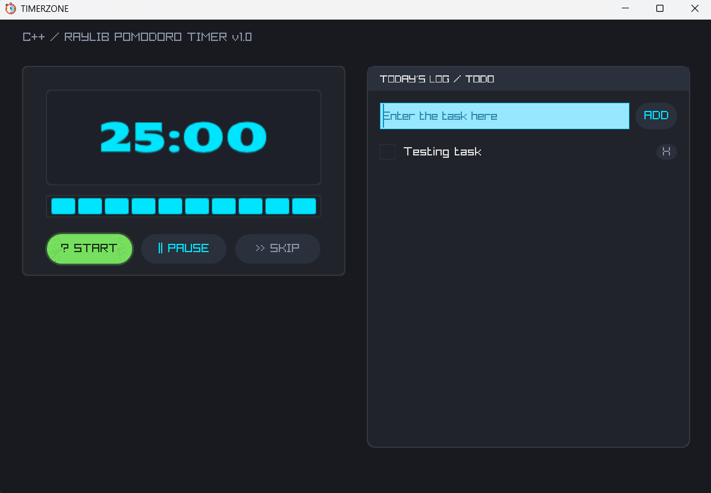

# Open Source Timer



A lightweight timer application built with C++.

## Features

- Simple and intuitive interface
- Accurate time tracking
- Open source and customizable

## Getting Started

### Prerequisites

- C++ compiler (C++11 or later)
- [Your build system, e.g., CMake, Make]

### Installation

```bash
git clone https://github.com/akagramishra/TimerZone.git
cd TimerZone
```

### Building

```bash
cmake build
make
```

## Usage

```bash
./timer
```

## Contributing

Contributions are welcome! Please feel free to submit a pull request.
